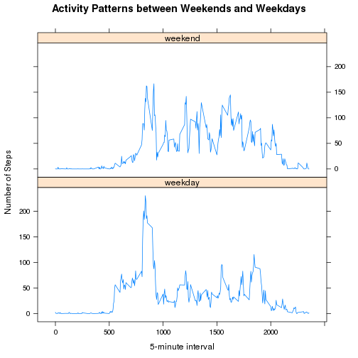

# Reproducible Research: Peer Assessment 1


## Loading and preprocessing the data

```r
data <- read.csv("activity.csv")
```


## What is mean total number of steps taken per day?
- histogram of the total number of steps taken each day

```r
date_steps <- aggregate(steps ~ date, data = data, sum)
hist(date_steps$steps, main = "Steps taken per day", xlab = "Number of steps")
```

 

- mean and median total number of steps taken per day

```r
mean_val <- round(mean(date_steps$steps), 0)
median_val <- round(median(date_steps$steps), 0)
```

 - Mean: 10766
 - Median: 10765

## What is the average daily activity pattern?

```r
intervals <- aggregate(steps ~ interval, data = data, mean)
plot(intervals$interval, intervals$steps, type = "l", main = "Average daily activity pattern", 
    xlab = "5-minute interval", ylab = "average number of steps taken")
```

 

```r
max_step_inv <- intervals[which.max(intervals$steps), "interval"]
```

- The 5-minute interval, on average across all days in the dataset, contains the maximum number of steps is **835**

## Imputing missing values  
Note that there are a number of days/intervals where there are missing values (coded as NA). The presence of missing days may introduce bias into some calculations or summaries of the data.

```r
missing <- length(data[complete.cases(data) == F, 1])
```

- total number of missing values is **2304**  

The new strategy for missing value is that **filling the mean steps for each interval**

```r
mean_of_intervals <- function() {
    steps <- data.frame(levels(factor(data$interval)), 0)
    colnames(steps) <- c("interval", "steps")
    for (i in 1:length(steps[, 1])) {
        m <- mean(data[data$interval == as.vector(steps[i, ]$interval) & !is.na(data$steps), 
            "steps"], na.rm = T)
        steps[i, ]$steps <- round(m, 0)
    }
    steps
}
```

Use the new strategy to create a new data set

```r
create_new_dataset <- function() {
    steps <- mean_of_intervals()
    new_data <- data
    for (i in 1:length(new_data[, 1])) {
        if (is.na(new_data[i, 1])) {
            new_data[i, 1] <- steps[steps$interval == new_data[i, "interval"], 
                2]
        }
        if (weekdays(as.Date(new_data[i, "date"])) %in% c("Saturday", "Sunday")) {
            new_data[i, "weekdays"] <- "weekend"
        } else {
            new_data[i, "weekdays"] <- "weekday"
        }
    }
    new_data
}
new_data <- create_new_dataset()
```


- histogram of the total number of steps taken each day based on new data set

```r
date_steps <- aggregate(steps ~ date, data = new_data, sum)
hist(date_steps$steps, main = "Steps taken per day", xlab = "Number of steps")
```

 

- mean and median total number of steps taken per day based on new data set

```r
mean_val <- round(mean(date_steps$steps), 0)
median_val <- round(median(date_steps$steps), 0)
```

 - Mean: 10766
 - Median: 10762

## Are there differences in activity patterns between weekdays and weekends?

```r
library(lattice)
date_steps <- aggregate(steps ~ interval + weekdays, data = new_data, mean)
xyplot(steps ~ interval | weekdays, data = date_steps, layout = c(1, 2), type = "l", 
    xlab = "5-minute interval", ylab = "Number of Steps", main = "Activity Patterns between Weekends and Weekdays")
```

 

